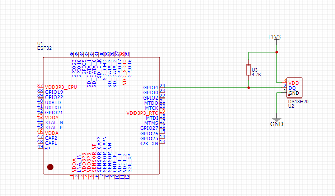
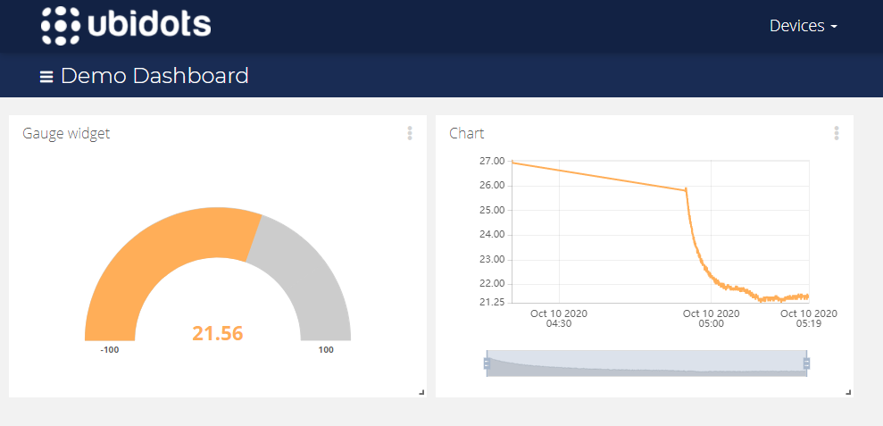

# ESP32-DS18b20
Um pequeno estudo em MQTT utilizando Esp32 e o sensor de temperatura DS18b20.
Utilizei o serviço ubidots para o armazenamento e exibição de dados.
Seguem abaixo resultados e esquematico.

